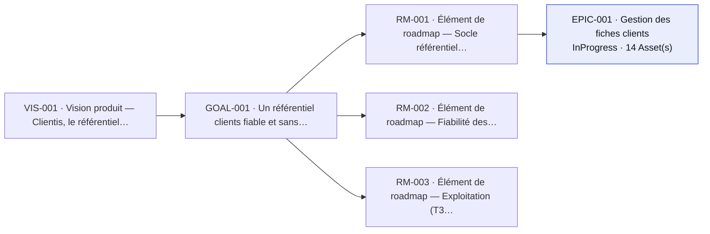

# Sommaire du produit

> Généré par `pef summary` et régénéré automatiquement par la CI — ne pas éditer à la main.

**28 Asset(s)** — 28 Approved. Trous de traçabilité : **0** (`pef coverage`).

## Vue par domaine fonctionnel

*Cap produit — [VIS-001](vision/VIS-001-vision-produit.vis.md) Vision produit — Clientis, le référentiel clients des TPE · objectifs : [GOAL-001](goals/GOAL-001-referentiel-fiable.goal.md).*

### Gestion des fiches clients ([EPIC-001](backlog/EPIC-001-gestion-des-clients.epic.md))

*Must · réalisation : InProgress · sert RM-001 → GOAL-001*

| ID | Type | Titre | État |
|---|---|---|---|
| [US-001](backlog/US-001-creer-un-client.us.md) | UserStory | Créer une fiche client | Validated |
| [BUG-001](backlog/BUG-001-doublon-casse-email.bug.md) | Bug | Doublon créé quand l'email ne diffère que par la casse | Validated |
| [REQ-001](requirements/REQ-001-creation-client.req.md) | Requirement | Création d'un client avec contrôle des données de contact | Approved |
| [BR-001](requirements/BR-001-email-unique.br.md) | BusinessRule | L'adresse email d'un client est unique dans le référentiel | Approved |
| [NFR-001](requirements/NFR-001-temps-de-reponse.nfr.md) | NonFunctionalRequirement | Temps de réponse de la création d'un client | Approved |
| [SPEC-001](specifications/SPEC-001-creation-client/SPEC-001-creation-client.spec.md) | Specification | Spécification — création d'une fiche client | Approved |
| [AC-001](specifications/SPEC-001-creation-client/AC-001-creation-nominale.ac.md) | AcceptanceCriteria | Création nominale d'une fiche client | Approved |
| [AC-002](specifications/SPEC-001-creation-client/AC-002-email-invalide-ou-duplique.ac.md) | AcceptanceCriteria | Rejet d'un email invalide ou déjà connu | Approved |
| [TP-001](quality/TP-001-recette-creation-client/TP-001-recette-creation-client.tp.md) | TestPlan | Plan de recette — création d'une fiche client | Approved |
| [TC-001](quality/TP-001-recette-creation-client/TC-001-creation-nominale.tc.md) | TestCase | Créer un client avec des données valides | Approved |
| [TC-002](quality/TP-001-recette-creation-client/TC-002-email-invalide.tc.md) | TestCase | Rejeter un email au format invalide | Approved |
| [TC-003](quality/TP-001-recette-creation-client/TC-003-email-duplique.tc.md) | TestCase | Rejeter un email déjà connu (insensible à la casse) | Approved |
| [DOC-001](documentation/fonctionnelle/DOC-001-gestion-clients-fonctionnelle.doc.md) | Doc Functional | Documentation fonctionnelle — gestion des fiches clients | Approved |
| [DOC-002](documentation/onboarding/DOC-002-parcours-onboarding.doc.md) | Doc Onboarding | Parcours d'onboarding — découvrir Clientis par les Assets | Approved |

✔ couverture complète

## Inventaire par type

### Vision

| ID | Titre | Statut | Version |
|---|---|---|---|
| [VIS-001](vision/VIS-001-vision-produit.vis.md) | Vision produit — Clientis, le référentiel clients des TPE | Approved | 1.0.0 |

### Objectifs

| ID | Titre | Statut | Version |
|---|---|---|---|
| [GOAL-001](goals/GOAL-001-referentiel-fiable.goal.md) | Un référentiel clients fiable et sans doublon | Approved | 1.0.0 |

### Roadmap

| ID | Titre | Statut | Version |
|---|---|---|---|
| [RM-001](roadmap/RM-001-socle-referentiel.rm.md) | Élément de roadmap — Socle référentiel clients (T1 2026) | Approved | 2.0.0 |
| [RM-002](roadmap/RM-002-fiabilite-donnees.rm.md) | Élément de roadmap — Fiabilité des données (T2 2026) | Approved | 1.0.0 |
| [RM-003](roadmap/RM-003-exploitation.rm.md) | Élément de roadmap — Exploitation (T3 2026) | Approved | 1.0.0 |

### Personas

| ID | Titre | Statut | Version |
|---|---|---|---|
| [PER-001](personas/PER-001-gerant-tpe.per.md) | Persona — Camille, gérant de TPE | Approved | 1.0.0 |

### Backlog

| ID | Titre | Type | Priorité | Contenu | Réalisation | Réf. externe |
|---|---|---|---|---|---|---|
| [BUG-001](backlog/BUG-001-doublon-casse-email.bug.md) | Doublon créé quand l'email ne diffère que par la casse | Bug | Must | Approved | Validated | — |
| [EPIC-001](backlog/EPIC-001-gestion-des-clients.epic.md) | Gestion des fiches clients | Epic | Must | Approved | InProgress | — |
| [US-001](backlog/US-001-creer-un-client.us.md) | Créer une fiche client | UserStory | Must | Approved | Validated | `CLI-42` |

### Exigences et règles

| ID | Titre | Statut | Version |
|---|---|---|---|
| [BR-001](requirements/BR-001-email-unique.br.md) | L'adresse email d'un client est unique dans le référentiel | Approved | 1.0.0 |
| [NFR-001](requirements/NFR-001-temps-de-reponse.nfr.md) | Temps de réponse de la création d'un client | Approved | 1.0.0 |
| [REQ-001](requirements/REQ-001-creation-client.req.md) | Création d'un client avec contrôle des données de contact | Approved | 1.0.0 |

### Spécifications

| ID | Titre | Statut | Version |
|---|---|---|---|
| [SPEC-001](specifications/SPEC-001-creation-client/SPEC-001-creation-client.spec.md) | Spécification — création d'une fiche client | Approved | 1.0.0 |

### Critères d'acceptation

| ID | Titre | Statut | Version |
|---|---|---|---|
| [AC-001](specifications/SPEC-001-creation-client/AC-001-creation-nominale.ac.md) | Création nominale d'une fiche client | Approved | 1.0.0 |
| [AC-002](specifications/SPEC-001-creation-client/AC-002-email-invalide-ou-duplique.ac.md) | Rejet d'un email invalide ou déjà connu | Approved | 1.0.0 |

### Recette

| ID | Titre | Statut | Version |
|---|---|---|---|
| [TC-001](quality/TP-001-recette-creation-client/TC-001-creation-nominale.tc.md) | Créer un client avec des données valides | Approved | 1.0.0 |
| [TC-002](quality/TP-001-recette-creation-client/TC-002-email-invalide.tc.md) | Rejeter un email au format invalide | Approved | 1.0.0 |
| [TC-003](quality/TP-001-recette-creation-client/TC-003-email-duplique.tc.md) | Rejeter un email déjà connu (insensible à la casse) | Approved | 1.0.0 |
| [TP-001](quality/TP-001-recette-creation-client/TP-001-recette-creation-client.tp.md) | Plan de recette — création d'une fiche client | Approved | 1.0.0 |

### Décisions

| ID | Titre | Statut | Version |
|---|---|---|---|
| [DEC-001](decisions/DEC-001-prefixes-ids-et-suffixes.dec.md) | Préfixes d'IDs, suffixes de fichiers et interdiction de renumérotation | Approved | 1.0.0 |
| [DEC-002](decisions/DEC-002-gherkin-recommande.dec.md) | Gherkin recommandé mais non obligatoire pour les AcceptanceCriteria | Approved | 1.0.0 |
| [DEC-003](decisions/DEC-003-versioning-semantique.dec.md) | Sémantique du versioning des Assets et non-invalidation automatique de l'aval | Approved | 1.0.0 |
| [DEC-004](decisions/DEC-004-priorisation-moscow.dec.md) | Priorisation des WorkItems par champ MoSCoW, ordonnancement fin hors PEF | Approved | 1.0.0 |
| [DEC-005](decisions/DEC-005-roadmap-par-element.dec.md) | La Roadmap est un Asset par élément, pas un document monolithique | Approved | 1.0.0 |
| [DEC-006](decisions/DEC-006-acces-code-multiroot.dec.md) | Accès au code par workspace multi-root et format des codeRefs | Approved | 1.0.0 |

### Releases

| ID | Titre | Statut | Version |
|---|---|---|---|
| [REL-001](releases/REL-001-version-0-1.rel.md) | Release 0.1 — création de fiches clients fiable | Approved | 1.0.0 |

### Documentation

#### Fonctionnelle

| ID | Titre | Statut | Version | État |
|---|---|---|---|---|
| [DOC-001](documentation/fonctionnelle/DOC-001-gestion-clients-fonctionnelle.doc.md) | Documentation fonctionnelle — gestion des fiches clients | Approved | 1.0.0 | à jour |

#### Onboarding

| ID | Titre | Statut | Version | État |
|---|---|---|---|---|
| [DOC-002](documentation/onboarding/DOC-002-parcours-onboarding.doc.md) | Parcours d'onboarding — découvrir Clientis par les Assets | Approved | 1.0.0 | à jour |

---

Naviguer : `pef trace <ID>` (chaîne d'un Asset) · `pef coverage` (trous) · `pef impact <ID>` (effets d'une modification).
